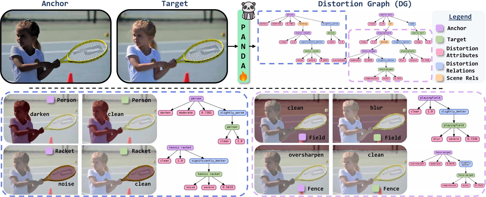

# ✨ Panoptic Pairwise Distortion Graph [ICLR 2026] ✨

Official codebase for **Panoptic Pairwise Distortion Graph**, accepted to **ICLR 2026**.
<p align="center">
  
</p>

---

## Overview

The core idea is to represent comparative image quality as a structured graph over paired images:

- **Objects / regions** correspond to matched semantic regions in an anchor image and a target image.
- **Attributes** capture region-level distortion type, severity, and score.
- **ART relations** capture whether a region in the anchor is the same / slightly better / significantly better / slightly worse / significantly worse than its counterpart in the target.
- **Scene relationships** can optionally be attached from panoptic scene graph annotations when available.

---

## Repository Structure

```text
.
├── config.yml                # Main experiment configuration
├── train.py                  # Distributed training + validation/testing
├── pandadg.py                # Model definition
├── loaddata.py               # PandaBench / DGBench dataset loader + collate fns
├── helper.py                 # Label maps, metrics helpers, utilities
├── non_graph_inference.py    # Standard evaluation script (acc/F1/SRCC/PLCC)
├── graph_inference.py        # Export predictions as distortion-graph JSON
├── plot_graph.py             # Render saved graph JSON with Graphviz
└── pandabench_idx.py         # Cached easy / medium test split indices
```

---

## Data

Download the dataset (~15GB) from: [Hugging Face Link](https://huggingface.co/datasets/kjanjua26/pandabench)

The default configuration expects the dataset under:

```text
data/pandabench/
```

with degradation-specific folders plus metadata/statistics JSON files. The config also expects per-degradation statistics files such as:

- `train_stats_mixed.json`
- `train_stats_snow.json`
- `train_stats_brightness.json`
- ...

and swaps `train` -> `val` / `test` automatically inside the loader depending on split.  

The expected directory pattern is effectively:

```text
data/pandabench/
├── gt/
│   ├── train/
│   ├── val/
│   └── test/
├── mixed/
│   ├── train/
│   ├── val/
│   └── test/
├── mixed2/
├── snow/
├── brightness/
├── contrast_inc/
├── contrast_dec/
├── compression/
├── saturate_inc/
├── saturate_dec/
├── oversharpen/
├── blur/
├── noise/
├── haze/
├── rain/
├── pixelate/
├── darken/
├── depth/
└── stats/
```

---

## Training

Training is launched through `train.py`, which initializes distributed training, builds a DeepSpeed config on the fly, creates an experiment directory under `ckpts/<experiment_name>/`, and logs TensorBoard runs to `runs/<experiment_name>/`. 

```bash
torch --standalone --nproc_per_node=8 train.py --name "pandadg_run01" --configpath config.yml
```

During training / validation / test, the code tracks metrics such as:

- comparison accuracy and recall@2,
- anchor/target distortion accuracy,
- anchor/target severity accuracy and recall@2,
- anchor/target score MAE,
- validation loss terms. 

Note: These metrics are just signals of training progressing and are not the metrics reported/used.

### Checkpoints

Checkpoints are saved to: `ckpts/<experiment_name>/`, with periodic saves like: `ep_10.pth` (control the saving epochs in config) and a final checkpoint like: `final_ep_<N>.pth`. Each checkpoint stores epoch, model state, optimizer state, and loss. 

---

## Inference

Use `non_graph_inference.py` to run evaluation and print numeric metrics. These are the metrics reported/used.

```bash
python non_graph_inference.py --configpath config.yml
```

This script loads the configured checkpoint, runs inference on the test split. Define the split of the testset in the `config.yml` file.

---

## Graph Export

Use `graph_inference.py` to convert model predictions into structured distortion graph JSON files.

```bash
python graph_inference.py --configpath config.yml
```

For each evaluated image pair, the script writes a JSON file to:

```text
inf_graphs/
```

with filenames of the form:

```text
<idx>_<img_tag>_<anchor_deg>_<target_deg>_<experiment_name>.json
``` 

### Graph Schema

The exported JSON uses four top-level fields:

- `objects`
- `attributes`
- `relationships`
- `art`

Conceptually:

- `objects` represent corresponding regions in anchor and target images,
- `attributes` store distortion / severity / score predictions for each region,
- `relationships` store within-image scene graph predicates when available,
- `art` stores cross-image comparative relations between matched regions. 

---

## Visualization

After exporting graph JSON files, you can render them with Graphviz using `plot_graph.py`.

```bash
python plot_graph.py
```

The plotting script reads a graph JSON file from `inf_graphs/`, builds a colored node-edge visualization, and saves a PNG using Graphviz. The default script uses a hard-coded input path, so you will usually want to edit the `path` variable first.

---

## Citation

If you use this codebase in your research, please cite the Distortion Graph paper.

```Coming Soon```

---
